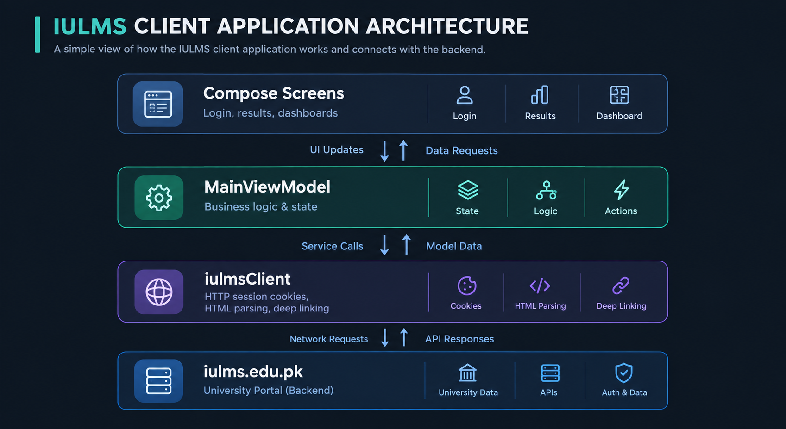

<p align="center">
  
</p>

<h1 align="center">MyIULMS</h1>

<p align="center">
  <strong>A modern, unofficial Android client for Iqra University IULMS.</strong>
</p>

<p align="center">
  
  
  
  <a href="https://github.com/Muhammmad-Ashhad-Ansari/MyIULMS/blob/main/LICENSE">
    
  </a>
</p>

<p align="center">
  Kotlin · Jetpack Compose · Material 3 · OkHttp · Jsoup
</p>

<p align="center">
  <a href="https://github.com/Muhammmad-Ashhad-Ansari/MyIULMS/releases/tag/v1.0.6"><strong>⬇ Download v1.0.6 APK</strong></a>
  ·
  <a href="https://github.com/Muhammmad-Ashhad-Ansari/MyIULMS/issues">Report an issue</a>
</p>

---

## MyIULMS: Your Academic Day, One Tap Away

Need to check your class, results, transcript, or fee vouchers? With the browser portal, that can mean going from login to the portal home, opening SIC, dismissing pop-ups, and then finding the page you need.

**MyIULMS brings the everyday academic essentials closer.** Open the app directly to your schedule, then move easily between attendance, results, transcript, and vouchers.

## Made for the things students check most

- **Know what’s happening in class:** See whether a class is live or coming up, its duration, and the time remaining.
- **Check attendance at a glance:** Open your attendance information without navigating through the wider portal.
- **Keep results and records handy:** View results and transcript details, and share result, transcript, or schedule as an image.
- **Track degree progress:** See completed credit hours and progress toward degree completion.
- **Stay ahead of vouchers:** Review voucher due or overdue status and the total outstanding amount.

**Less time finding the right page. More time getting on with your day.**

MyIULMS is a focused companion for common student tasks. The university portal remains the place for its broader services; the app makes frequently checked academic information easier to reach.

---

## Core modules

| Module | What you get |
|---|---|
| **Schedule** | Weekly classes and exams, weekday shortcut bar, class times with duration, room and faculty |
| **Attendance** | Course-wise present/absent totals, percentage, expandable session records |
| **Result** | Course marks, totals, grades, grade points, semester GPA, and academic insights |
| **Transcript** | CGPA, courses, credit hours, grades, GPA values, and degree progress |
| **Vouchers** | Fee amounts, due dates, due/overdue indicators, save or print as PDF |

Across every module: **sign in with session recovery**, **password-manager support**, **shareable images**, and **light/dark themes** with a saved preference.

---

## How it works

<p align="center">
  
</p>

The app signs in to the existing portal, keeps session cookies in memory, fetches authenticated pages with OkHttp, and parses HTML with Jsoup or transcript JSON with `org.json`. Results are held by the `MainViewModel` and rendered with Jetpack Compose. When a session expires the client signs in again and retries the request.

Because it depends on IULMS page structures and endpoints, portal changes may require updates to the network or parsing code.

---

## Build and run

### Requirements

- Android Studio and Android SDK (compile SDK 37)
- JDK 11 or newer
- An existing IULMS student account to use the app

```bash
git clone https://github.com/Muhammmad-Ashhad-Ansari/MyIULMS.git
cd MyIULMS
```

### Debug APK

```bash
./gradlew clean assembleDebug
```

```powershell
.\gradlew.bat clean assembleDebug
```

Output: `app/build/outputs/apk/debug/app-debug.apk`

### Release APK

```bash
./gradlew clean assembleRelease
```

```powershell
.\gradlew.bat clean assembleRelease
```

> **Signing:** release builds are unsigned by default. Configure a keystore before distributing, and reuse the **same** key for every future update or existing installs cannot upgrade. Keep a secure backup; never commit it.

### Tests

```bash
./gradlew testDebugUnitTest
```

```powershell
.\gradlew.bat testDebugUnitTest --rerun-tasks
```

74 unit tests covering schedule interval maths, day-index arithmetic, sticky-header highlight selection, portal parsing, and transcript analytics.

---

## Project structure

```text
MyIULMS/
├── app/
│   ├── src/main/
│   │   ├── java/com/example/myiulms/
│   │   │   ├── Iulms.kt                 # Portal client, models, parsers, secure store
│   │   │   ├── MainActivity.kt          # Compose UI, navigation, share triggers
│   │   │   ├── MainViewModel.kt         # Authentication and screen state
│   │   │   ├── TranscriptAnalytics.kt   # Transcript and credit-hour calculations
│   │   │   ├── ShareAcademic.kt         # Shareable result, transcript and schedule images
│   │   │   ├── VoucherDownload.kt       # Voucher PDF saving and rendering
│   │   │   ├── VoucherPrintActivity.kt  # Voucher preview and print screen
│   │   │   └── ui/
│   │   │       ├── theme/               # Colours, typography, spacing and radius tokens
│   │   │       ├── dashboard/           # Countdown card and schedule interval logic
│   │   │       └── policy/              # Grading and scholarship reference sheet
│   │   ├── res/                         # Android resources
│   │   └── AndroidManifest.xml
│   └── build.gradle.kts
├── docs/images/                         # App icon and architecture diagram
├── gradle/                              # Gradle version catalog and wrapper config
├── build.gradle.kts
└── settings.gradle.kts
```

---

## Technology

| Area | Technology |
|---|---|
| Language | Kotlin 2.2.10 |
| Android UI | Jetpack Compose (BOM 2026.02.01), Material 3 |
| State | Android ViewModel and Compose state |
| Networking | OkHttp 4.12 |
| HTML parsing | Jsoup 1.17 |
| JSON parsing | `org.json` |
| Async work | Kotlin Coroutines |
| Credential storage | AndroidX Security Crypto |
| Minimum Android | 8.0 (API 26) |
| Target SDK | Android API 37 |

---

## Trust and privacy

**MyIULMS is unofficial.** It is a student project, not built or approved by Iqra University, and not a replacement for IULMS.

**Where your login goes.** Signing in sends your registration number and password over HTTPS to `iulms.edu.pk`, exactly as a browser would. MyIULMS has no server and no student database, so nothing is sent to the project or any third party. Credentials are entered by you and are never hard-coded in source. The app requests one Android permission: internet — no analytics, telemetry, or crash reporting.

**What is stored on your device.**

| | Remember me **on** | Remember me **off** |
|---|---|---|
| Credentials on disk | Yes, via AndroidX `EncryptedSharedPreferences` backed by Android Keystore | Nothing is written to disk |
| Included in cloud backup / phone transfer | No — excluded by the app's backup rules | Not applicable |
| Session cookies | Memory only, cleared on sign-out | Memory only |

This protects a lost or backed-up phone well. It does **not** protect a rooted device, or one running software that can read app files, and no app can promise credentials can never leak. Signing out ends the session but does **not** delete remembered credentials — log in again with "Remember me" unticked, or uninstall, to remove them.

**Before you share.** Result, transcript, and schedule images include your **name**. Check an image before posting it. The app does not block screenshots.

**Portal dependency.** Everything shown comes from IULMS, fetched when you open a screen; nothing is cached offline. If the portal is down or its pages change, parts of the app will stop working until updated.

**Signing.** The released APK uses the project's Android debug certificate:

```text
SHA-256: fc27702dc58fa23597ea983a9227db642b3510b2b29c12c342d24a979d19aaa3
```

This identifies **which certificate signed the file**, so you can confirm an update came from the same source as the version you already have. It does not certify the publisher, does not imply any Iqra University affiliation, and is not a security audit.

Full detail, including exactly what the app does and does not do with your data, is in [docs/student-trust-and-community-faq.md](docs/student-trust-and-community-faq.md). Prefer to read the code first? [Build it yourself](#debug-apk).

> ### ⚠️ Local-only handoff file
>
> `AI_HANDOFF.md` is a working artifact for AI-assisted sessions and is **deliberately excluded from version control** via `.git/info/exclude`. It is never committed and never published.
>
> That exclusion is clone-local, so **a fresh clone will show it as untracked.** Add an `AI_HANDOFF.md` line to the shared `.gitignore` if you want it ignored everywhere.
>
> Never commit keystores, `local.properties`, `.env` files, or captured session data.

---

## Academic policy reference

Main Campus grading scales and merit-scholarship criteria are available in-app as a **read-only reference** — open it from the dashboard overflow menu or the header action on the Result and Transcript tabs.

It is display-only. It does not evaluate pass/fail, degree eligibility, or scholarship entitlement, and your portal result remains the record of your grades. Figures were transcribed from published university material; where this and the Office of the Registrar or the official handbook disagree, **the official source wins**.

---

## Limitations

- IULMS HTML and JSON changes can affect data loading.
- Portal account types and historical records vary; not every variation is supported.
- Voucher availability and output depend on what IULMS returns for the signed-in account.
- Layout figures quoted here are computed from design tokens, not measured on physical hardware.

---

## Contributing

Issues and pull requests are welcome. Include the affected screen and what happened. **Do not include passwords, session cookies, tokens, or any private account information.**

---

## Disclaimer and license

MyIULMS is an unofficial student project, not affiliated with Iqra University. Iqra University, IULMS, and their names and marks belong to their respective owners. The app depends on the university portal and may be affected by changes to it.

Source available under the [MIT License](LICENSE). University names, marks, and other third-party assets are not granted additional rights by that license.

---

<p align="center">Made by <strong>Muhammad Ashhad</strong> as an independent project.</p>