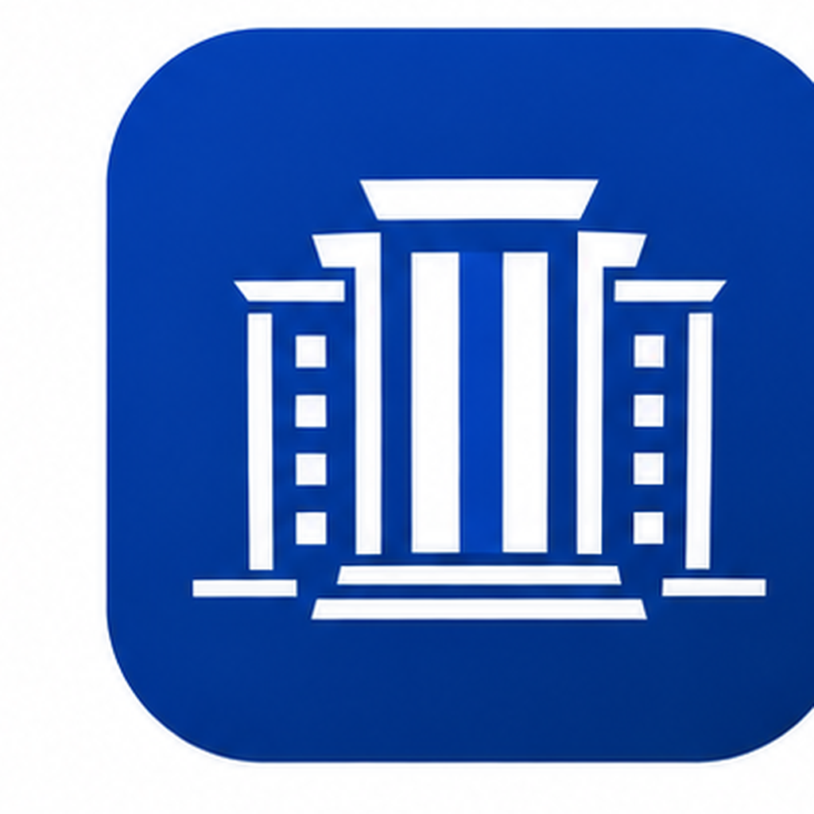

<p align="center">
  
</p>

<h1 align="center">MyIULMS</h1>

<p align="center">
  <strong>A modern, unofficial Android client for Iqra University IULMS.</strong>
</p>

<p align="center">
  <a href="https://github.com/Muhammmad-Ansari/MyIULMS/releases/tag/v1.0.5">
    
  </a>
  
  
  
</p>

<p align="center">
  Kotlin · Jetpack Compose · Material 3 · OkHttp · Jsoup
</p>

<p align="center">
  <a href="https://github.com/Muhammmad-Ansari/MyIULMS/releases/latest"><strong>⬇ Download latest APK</strong></a>
  ·
  <a href="https://github.com/Muhammmad-Ansari/MyIULMS/blob/main/LICENSE">MIT License</a>
  ·
  <a href="https://github.com/Muhammmad-Ansari/MyIULMS/issues">Report an issue</a>
</p>

---

## About

**MyIULMS** is an independent Android app that presents selected student services from [Iqra University's IULMS portal](https://iulms.edu.pk) in a mobile-first interface. Sign in with an existing IULMS account to view academic records and fee information.

The app connects directly to IULMS. It does not use a MyIULMS backend.

> **Unofficial project:** MyIULMS is not affiliated with, maintained by, sponsored by, or endorsed by Iqra University.

---

## What's new in v1.0.5

| Area | Change |
|---|---|
| **Navigation** | The flat bottom tab bar is now a translucent floating capsule with a spring-animated selection pill and a scheme-aware gradient rim. |
| **Weekly schedule** | The `MON`–`SUN` row is lifted out of the scrolling list and stays frozen at the top, so weekday switching is always one tap away. |
| **Day headings** | Restored as sticky headers behind invisible full-width masks, giving clean push-out transitions without cards ghosting through the labels. |
| **Course cards** | Height compressed to roughly 146 dp with room and teacher side by side, so long names stay readable on one line. |
| **Sharing** | Schedule sharing produces a high-resolution image rendered on a background dispatcher, branded with the student's name. |
| **Sign-in** | The footer steps aside when the keyboard opens, clearing space instead of jumping into the form. |

All 74 unit tests pass. Changes are described in the [v1.0.5 release notes](https://github.com/Muhammmad-Ansari/MyIULMS/releases/tag/v1.0.5).

---

## Features

- **Sign in and session recovery** using an existing IULMS account
- **Password-manager support** for saved registration numbers and passwords
- **Exam results** with course marks, totals, grades, grade points, and semester GPA when provided
- **Schedules** for exams and recurring weekly classes, with weekday shortcuts, class times, duration, faculty, and location
- **Attendance** with course-wise present/absent totals, attendance percentage, and expandable session records
- **Fee vouchers** with amounts, due dates, and due/overdue indicators; open a voucher to save or print it as a PDF
- **Transcript** with CGPA, courses, credit hours, grades, and GPA values
- **Academic insights** including credit-hour progress and weak-course filtering
- **Shareable academic images** for results, transcripts, and the weekly timetable
- **Light and dark themes** with a saved theme preference

---

## How it works

<p align="center">
  
</p>

The app signs in to the existing portal, keeps session cookies in memory, fetches authenticated pages with OkHttp, and parses HTML with Jsoup or transcript JSON with `org.json`. The resulting Kotlin data is held by the `MainViewModel` and displayed with Jetpack Compose. When a session expires, the client attempts to sign in again and retry the request.

Since the app relies on IULMS page structures and endpoints, changes to the university portal may require updates to its network or parsing code.

---

## Technical playbook

### Requirements

- Android Studio and Android SDK (compile SDK 37)
- JDK 11 or newer
- An existing IULMS student account to use the app

### Clone

```bash
git clone https://github.com/Muhammmad-Ansari/MyIULMS.git
cd MyIULMS
```

### Debug APK

```bash
./gradlew clean assembleDebug
```

```powershell
.\gradlew.bat clean assembleDebug
```

Output: `app/build/outputs/apk/debug/app-debug.apk`

### Signed release APK

Release builds are unsigned by default in this project. Configure a keystore, then build:

```bash
./gradlew clean assembleRelease
```

```powershell
.\gradlew.bat clean assembleRelease
```

Output: `app/build/outputs/apk/release/app-release-*.apk`

> **Signing contract:** future APK updates must reuse the same signing key, or existing installations cannot upgrade over them. Keep a secure backup of that key and never commit it to this repository. See [Privacy and credentials](#privacy-and-credentials) for what must never be committed.

### Run the test suite

```bash
./gradlew testDebugUnitTest
```

```powershell
.\gradlew.bat testDebugUnitTest --rerun-tasks
```

74 unit tests across schedule interval math, day-index arithmetic, sticky-header highlight dominance, portal parsing, and transcript analytics.

---

## Project structure

```text
MyIULMS/
├── app/
│   ├── src/main/
│   │   ├── java/com/example/myiulms/
│   │   │   ├── Iulms.kt                 # Portal client, models, parsers, secure store
│   │   │   ├── MainActivity.kt          # Compose UI, navigation, share triggers
│   │   │   ├── MainViewModel.kt         # Authentication and screen state
│   │   │   ├── TranscriptAnalytics.kt   # Transcript and credit-hour calculations
│   │   │   ├── ShareAcademic.kt         # Shareable result/transcript/schedule images
│   │   │   ├── VoucherDownload.kt       # Voucher PDF saving and rendering
│   │   │   ├── VoucherPrintActivity.kt  # Voucher preview and print screen
│   │   │   └── ui/
│   │   │       ├── theme/               # Colors, typography, spacing and radius tokens
│   │   │       ├── dashboard/           # Countdown card and schedule interval logic
│   │   │       └── policy/              # Grading and scholarship reference sheet
│   │   ├── res/                         # Android resources
│   │   └── AndroidManifest.xml
│   └── build.gradle.kts
├── docs/images/                         # Architecture diagram
├── gradle/                              # Gradle version catalog and wrapper config
├── build.gradle.kts
└── settings.gradle.kts
```

---

## Technology

| Area | Technology |
|---|---|
| Language | Kotlin 2.2.10 |
| Android UI | Jetpack Compose (BOM 2026.02.01) and Material 3 |
| State | Android ViewModel and Compose state |
| Networking | OkHttp 4.12 |
| HTML parsing | Jsoup 1.17 |
| JSON parsing | `org.json` |
| Async work | Kotlin Coroutines |
| Credential storage | AndroidX Security Crypto |
| Minimum Android version | Android 8.0 (API 26) |
| Target SDK | Android API 37 |

---

## Privacy and credentials

- Credentials are entered by the user and are not hard-coded in the app source.
- If **Remember me** is selected, login details are stored locally using AndroidX `EncryptedSharedPreferences` backed by Android Keystore encryption.
- The encrypted credential file is excluded from Android cloud backups and device-to-device transfers.
- Session cookies are kept in the running app's HTTP client.
- Academic requests go directly to IULMS; the project has no separate application backend.

This is an independent student project. Review the source and use your own judgment before entering account credentials.

> ### ⚠️ Local-only handoff file
>
> `AI_HANDOFF.md` is a working artifact for AI-assisted sessions and is **deliberately excluded from version control** via `.git/info/exclude`. It is never committed and never published to a release.
>
> Because that exclusion lives in `.git/info/exclude` — a local, clone-specific file — **a fresh clone will show `AI_HANDOFF.md` as untracked.** If you want it ignored everywhere, add an `AI_HANDOFF.md` line to the shared `.gitignore`.
>
> Never commit keystores, `local.properties`, `.env` files, or any captured session data.

---

## Releases

The latest stable release, [**MyIULMS v1.0.5**](https://github.com/Muhammmad-Ansari/MyIULMS/releases/tag/v1.0.5), is available on GitHub Releases.

| Version | Code | Summary |
|---|---|---|
| 1.0.5 | 13 | Capsule navbar, hoisted day-chips, compressed course cards, async PNG schedule sharing, IME-gated login footer |
| 1.0.4 | 11 | Swipe navigation across the five tabs, live class countdown card |
| 1.0.3 | 10 | Automatic GitHub update checking after sign-in, 6-hour cooldown, silent failure |
| 1.0.2 | 9 | Read-only Main Campus grading and merit-scholarship reference |
| 1.0.1 | 8 | In-app update check |

Future APK updates must use the same signing key so existing installations can update; keep a secure backup of that key and never commit it to this repository.

---

## Academic policy reference

Iqra University Main Campus grading scales and merit-scholarship criteria are available in-app as a **read-only reference**. Open it from the dashboard overflow menu ("Grading & scholarship policy") or from the header action on the Result and Transcript tabs.

The reference is display-only. It does not evaluate pass/fail, degree eligibility, or scholarship entitlement, and your portal result remains the record of your actual grades. Figures were transcribed from published university material; where this reference and the Office of the Registrar or the official undergraduate handbook disagree, **the official source wins**. Please report any discrepancy.

---

## Current scope and limitations

- IULMS HTML and JSON changes can affect data loading.
- Portal account types and historical records may vary; not every variation is guaranteed to be supported.
- Voucher availability and output depend on what IULMS returns for the signed-in account.
- Layout figures quoted in this README are computed from design tokens, not measured on physical hardware.

---

## Contributing

Bug reports and pull requests are welcome. When reporting an issue, include the affected screen and a description of what happened. **Do not include passwords, session cookies, authentication tokens, or other private account information.**

---

## Disclaimer and license

MyIULMS is an unofficial student project and is not affiliated with Iqra University. Iqra University, IULMS, and their related names and marks belong to their respective owners. The app depends on the university's portal and may be affected by changes to that service.

The source code is available under the [MIT License](LICENSE). University names, marks, and other third-party assets are not granted additional rights by that license.

---

<p align="center">Made by <strong>Muhammad Ashhad</strong> as an independent project.</p>