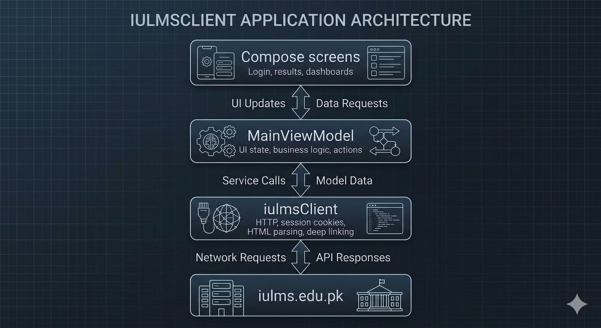

# MyIULMS

<p align="center">
  <strong>A modern, unofficial Android client for Iqra University IULMS.</strong>
</p>

<p align="center">
  Kotlin • Jetpack Compose • Material 3 • OkHttp • Jsoup
</p>

<p align="center">
  <a href="https://github.com/Muhammmad-Ashhad-Ansari/MyIULMS/releases/latest">
    
  </a>
  <a href="https://github.com/Muhammmad-Ashhad-Ansari/MyIULMS/blob/main/LICENSE">
    
  </a>
  
  
</p>

<p align="center">
  <a href="https://github.com/Muhammmad-Ashhad-Ansari/MyIULMS/releases/latest"><strong>Download latest APK</strong></a>
  ·
  <a href="https://github.com/Muhammmad-Ashhad-Ansari/MyIULMS/issues">Report an issue</a>
</p>

---

## About

**MyIULMS** is an independent Android app that presents selected student services from [Iqra University's IULMS portal](https://iulms.edu.pk) in a mobile-first interface. Sign in with an existing IULMS account to view academic records and fee information.

The app connects directly to IULMS. It does not use a MyIULMS backend.

> **Unofficial project:** MyIULMS is not affiliated with, maintained by, sponsored by, or endorsed by Iqra University.

## Features

- **Sign in and session recovery** using an existing IULMS account
- **Password-manager support** for saved registration numbers and passwords
- **Exam results** with course marks, totals, grades, grade points, and semester GPA when provided
- **Schedules** for exams and recurring weekly classes, with weekday shortcuts, class times, duration, faculty, and location
- **Attendance** with course-wise present/absent totals, attendance percentage, and expandable session records
- **Fee vouchers** with amounts, due dates, and due/overdue indicators; open a voucher to save or print it as a PDF
- **Transcript** with CGPA, courses, credit hours, grades, and GPA values
- **Academic insights** including credit-hour progress and weak-course filtering
- **Shareable academic summaries** for results and transcripts
- **Light and dark themes** with a saved theme preference

## How it works

<p align="center">
  
</p>

The app signs in to the existing portal, keeps session cookies in memory, fetches authenticated pages with OkHttp, and parses HTML with Jsoup or transcript JSON with `org.json`. The resulting Kotlin data is held by the `MainViewModel` and displayed with Jetpack Compose. When a session expires, the client attempts to sign in again and retry the request.

Since the app relies on IULMS page structures and endpoints, changes to the university portal may require updates to its network or parsing code.

## Privacy and credentials

- Credentials are entered by the user and are not hard-coded in the app source.
- If **Remember me** is selected, login details are stored locally using AndroidX `EncryptedSharedPreferences` backed by Android Keystore encryption.
- The encrypted credential file is excluded from Android cloud backups and device-to-device transfers.
- Session cookies are kept in the running app's HTTP client.
- Academic requests go directly to IULMS; the project has no separate application backend.

This is an independent student project. Review the source and use your own judgment before entering account credentials.

## Project structure

```text
MyIULMS/
├── app/
│   ├── src/main/
│   │   ├── java/com/example/myiulms/
│   │   │   ├── Iulms.kt                 # Portal client, models, parsers, secure store
│   │   │   ├── MainActivity.kt          # Compose UI and navigation
│   │   │   ├── MainViewModel.kt         # Authentication and screen state
│   │   │   ├── TranscriptAnalytics.kt   # Transcript and credit-hour calculations
│   │   │   ├── ShareAcademic.kt         # Shareable result/transcript images
│   │   │   ├── VoucherDownload.kt       # Voucher PDF saving and rendering
│   │   │   ├── VoucherPrintActivity.kt  # Voucher preview and print screen
│   │   │   └── ui/theme/                # Colors, typography, and theme tokens
│   │   ├── res/                         # Android resources
│   │   └── AndroidManifest.xml
│   └── build.gradle.kts
├── gradle/                              # Gradle version catalog and wrapper config
├── build.gradle.kts
└── settings.gradle.kts
```

## Technology

| Area | Technology |
|---|---|
| Language | Kotlin |
| Android UI | Jetpack Compose and Material 3 |
| State | Android ViewModel and Compose state |
| Networking | OkHttp 4.12 |
| HTML parsing | Jsoup 1.17 |
| JSON parsing | `org.json` |
| Async work | Kotlin Coroutines |
| Credential storage | AndroidX Security Crypto |
| Minimum Android version | Android 8.0 (API 26) |
| Target SDK | Android API 37 |

## Build and run

### Requirements

- Android Studio and Android SDK
- Internet access
- An existing IULMS student account to use the app

Clone the repository and open it in Android Studio:

```bash
git clone https://github.com/Muhammmad-Ashhad-Ansari/MyIULMS.git
cd MyIULMS
```

Build a debug APK from the project root:

```bash
./gradlew assembleDebug
```

On Windows PowerShell:

```powershell
.\gradlew assembleDebug
```

The APK is generated at `app/build/outputs/apk/debug/app-debug.apk`.

Run the local unit tests with:

```bash
./gradlew testDebugUnitTest
```

## Releases

The first stable release, [**MyIULMS v1.0.0**](https://github.com/Muhammmad-Ashhad-Ansari/MyIULMS/releases/tag/v1.0.0), is available on GitHub Releases. It includes the signed APK (version code **7**). Future APK updates must use the same signing key so existing installations can update; keep a secure backup of that key and never commit it to this repository.

## Current scope and limitations

- IULMS HTML and JSON changes can affect data loading.
- Portal account types and historical records may vary; not every variation is guaranteed to be supported.
- Voucher availability and output depend on what IULMS returns for the signed-in account.

## Contributing

Bug reports and pull requests are welcome. When reporting an issue, include the affected screen and a description of what happened. **Do not include passwords, session cookies, authentication tokens, or other private account information.**

## Disclaimer and license

MyIULMS is an unofficial student project and is not affiliated with Iqra University. Iqra University, IULMS, and their related names and marks belong to their respective owners. The app depends on the university's portal and may be affected by changes to that service.

The source code is available under the [MIT License](LICENSE). University names, marks, and other third-party assets are not granted additional rights by that license.

---

Made by **Muhammad Ashhad** as an independent project to make everyday IULMS access more convenient on Android.
